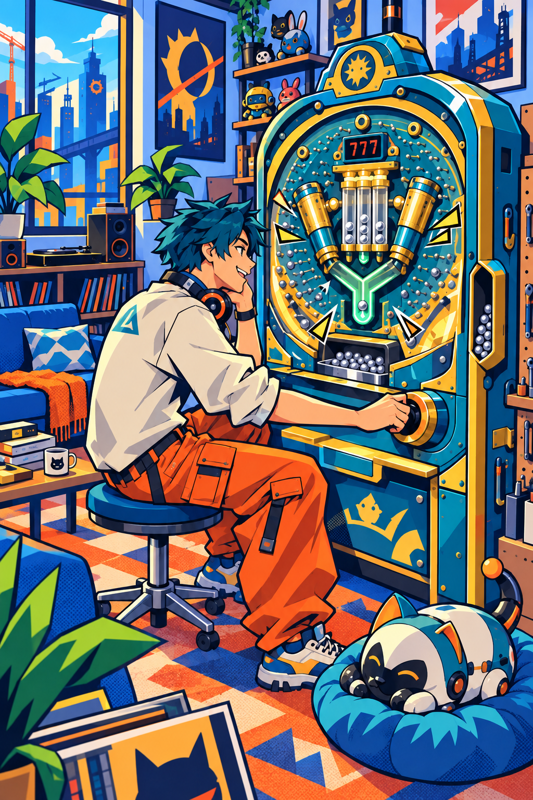

# Project H — 세계관·아트 방향 초안 v0.1

작성: 2026-09-09
기준: GDD v0.7 및 이후 성장·재화·온보딩·화풍 논의.

## 1. 문서의 역할과 상태

세계의 생활 모습과 게임 시스템의 의미를 연결하는 별도 문서다. **합의**는 사용자가 선택한 방향, **제안**은 이번 세계관 초안, **미정**은 후속 결정이다. 새 도시 이름·에너지 원리·제작사 설정은 모두 제안이다. 이 문서로 GDD의 시스템·출시 범위·가격을 자동 변경하지 않는다.

**합의한 시각 방향:** 하이파이 러시를 모티브로 한 또렷한 만화풍, 선명한 색면·과장된 기계 형태·기계식 동작. 수정 콘셉트아트의 방향을 기준으로 삼되 전체 채도가 강해 오래 보기에 부담스러울 수 있다는 사용자 의견을 반영한다.

[기준 콘셉트아트](art/room-comic-direction-v0.2.png)

이 이미지는 분위기 탐색용이다. 인물의 성별·외모, 로봇 펫, 방 평면·시점, 기계 크기와 브랜드 로고는 확정 사양이 아니다. 실제 게임 UI나 구현된 방 화면도 아니다.

## 2. 세계의 한 문장 — 제안

**구슬 기계가 생활 에너지를 만드는 도시에서, 작은 작업실을 얻은 플레이어가 자기 취향의 기계를 모으고 개량하며 공간을 꾸미는 이야기.**

도시 가칭은 **스파크타운**으로 둔다. 이름은 검색·상표·출시 검토를 거친 명칭이 아니며 문서 안의 임시 호칭이다. ‘공진’ 같은 전문 용어를 외워야 플레이할 필요는 없다. 주민들은 일상적으로 ‘기계 돌린다’, ‘오늘 잘 터졌다’, ‘새 부품 구했다’고 말한다.

플레이어는 거창한 임무를 받은 영웅보다 자기 공간을 가꾸는 새로운 주민이다. 아끼는 기계를 장만하고, 원하는 물건으로 방을 꾸미고, 가끔 축제에 참가한다. 도시 구하기·의무 생산량·생활비 고갈을 새 게임 규칙으로 추가하지 않는다.

## 3. 이 도시의 생활 — 제안

도시는 현대적인 생활 공간에 장난스럽게 과장된 기계 설비가 섞인 곳이다. 작은 작업실과 원룸, 제작사 간판, 운송 레일, 기계 상점, 옥상 정원과 동네 공연장이 어울린다. 공장은 있지만 세계 전체를 어둡고 거대한 산업 시설로 채우지 않는다.

주민들에게 기계는 생활 설비이면서 오디오·자동차·취미 장비 같은 애착의 대상이다. 최신형을 자랑하는 사람도 있고 오래된 기계의 소리와 움직임을 좋아하는 사람도 있다. 같은 기계의 마스코트 인형·포스터·스티커를 모으는 문화가 자연스럽게 존재한다.

플레이어의 공간은 **생활과 취미가 함께 있는 개인 작업실**이다. 소파 옆에 기계가 있고 선반에는 수집품이 놓인다. 시작 방 콘셉트는 장식 취향의 선택이다. 모든 방을 동일한 공장 작업장처럼 만들지는 않는다.

## 4. 왜 구슬을 돌리면 보상이 생기는가 — 제안

이 세계에는 장치로 회수할 수 있는 가상의 주변 에너지가 있다. 금속 구슬은 그 에너지를 모으는 기계 안의 순환 매개체다. 운동 자체에서 무한한 에너지를 만든다는 현실 과학 설명을 하지 않는다.

핀을 통과한 구슬이 특정 입구에 들어가면 장치가 작동 조건을 탐색한다. 조건이 맞으면 증폭이 일어나고, 실린더·날개·저장통이 열려 고출력 운전으로 넘어간다. 생산 결과는 지역의 공동 공급망에 보내며, 플레이어는 코인으로 대가를 받는다.

자동 운전과 발사 방향 조절은 기계의 기본 편의 기능이다. 캐릭터는 좋아하는 기계 곁에서 작동을 구경하거나 세기를 직접 조절한다. 플레이어가 화면을 계속 만져야 생산되는 설정은 아니다.

### 기계 경험과 세계 속 의미

| 게임 요소 | 세계 속 설명 후보 | 게임에서 유지할 점 |
|---|---|---|
| 발사·핀 경로 | 구슬 순환과 에너지 집속 | 눈에 보이는 실제 구슬 경로 |
| 헤소·일반 추첨 | 증폭 조건 탐색 | 기계별 고유 당첨 확률 |
| 당첨 | 증폭 조건 성립 | 명확한 신호·긴장 해소 |
| 아타커 입상 | 열린 회수 장치에 구슬 공급 | 넣은 구슬이 실제 충전·보상으로 연결 |
| 지급 라운드 | 회수 장치가 정해진 용량을 순서대로 처리 | 입상 수·지급 속도·라운드 제한 |
| 쏟아지는 구슬 | 기계가 성과를 계량해 받침으로 배출하는 장면 | 은색 구슬과 금속 지급음 유지 |
| 변형 러쉬 | 증폭 장치를 개방한 고출력 운전 | 외형·입구 변화, 연장 중 유지 |
| 코인 | 생산 대가로 받는 도시의 통화 | 꾸미기·티켓 구매의 기본 재화 |

에너지는 우선 **설정과 연출을 위한 설명**이다. 별도 에너지 잔고·수동 판매·연료 충전·송전 미니게임을 추가하지 않는다. 구슬 계기와 코인 전환의 정확한 표현·산식은 경제 설계에서 정한다. 세계관 명칭으로 실제 지급 규칙을 흐리지 않는다.

## 5. 기계 성장의 의미

### 대화에서 합의한 게임 방향

- 초기 등급·성급·컬렉션 성장은 생산량을 높이는 방향이다. 성장 때문에 당첨 확률·러쉬 연장률·기계 고유 지급 리듬을 바꾸지 않는다.
- 높은 확률·작은 지급과 낮은 확률·큰 지급은 기계 자체의 개성으로 밸런스 조정한다.
- 중복 기계는 해당 기계 부품으로 받고, 첫 중복 한 번으로 첫 성급 상승을 경험한다.
- 생산 배율·성급별 비용·상한·등급 차이는 미정이다.

### 세계관 해석 — 제안

**등급:** 회수·변환 장치의 기본 성능 차이다. 희귀한 소재나 정교한 변환부가 같은 기계 성과에서 더 많은 유효 에너지를 회수한다. 높은 등급이 무조건 자주 당첨된다는 의미는 아니다.

**성급:** 해당 기계의 전용 부품을 장착해 회수 효율을 개량한다. 구슬판과 추첨 성격은 유지하고, 배출·변환부가 개선되는 설명이다. 별 개수만큼 대규모 외형 변형을 제작해야 한다는 요구는 없다.

**컬렉션:** 새 기계를 등록하면 그 기계의 운전·보정 자료를 개인 제어기에 추가한다. 서로 다른 자료를 익힌 제어기는 현재 가동 기계의 회수 효율을 개선한다. 보관 중인 기계가 전부 동시에 가동돼야 한다는 설정을 피하고, 보유 수집의 공통 보너스를 설명하는 안이다. 실제 반영 기준과 배율은 아직 정하지 않는다.

낮은 등급 기계를 계속 사용하는 것은 취향 있는 선택으로 남겨둔다. 세계관 설명만으로 경제적 불이익이 해결됐다고 판단하지 않고 실제 효율 차이를 검증한다.

## 6. 기계는 어떻게 얻는가

### 합의한 재화·첫 획득 방향

- 코인으로 가챠용 티켓을 구매하고, 이벤트·그랑프리 보상으로도 티켓을 제공하는 방향이다.
- 코인·티켓 가격과 과금 연결은 명시적으로 보류한다. 유료 전용 재화나 유료 가챠를 도입한 결정은 아니다.
- 첫 무료 뽑기는 **고정 보상**이다. 초기 지급 기계와 같은 등급의 자매 기계를 준다.
- 일반 기계 획득에는 가챠와 원하는 기계 지정 천장 방향을 검토하고 있다. 세부 확률·이월·교환 조건은 미정이다.

### 유통 설정 — 제안

여러 제작사가 참여하는 **기계 협동상점**이 주민에게 기계 공급을 맡는다. 일반 티켓은 여러 제작사의 출고품을 받는 무작위 공급권이다. 상점의 재미있는 배송·개봉 연출이 뽑는 순간의 기대감을 만든다.

지정 천장은 공급 이용 실적을 모아 원하는 모델을 지정 주문하는 서비스로 설명한다. 정확한 횟수와 적용 범위는 시스템 결정을 따른다.

이미 등록한 모델을 다시 받으면 협동상점이 완성품 대신 해당 모델의 개량 부품 꾸러미로 제공한다. 같은 거대 기계를 매번 방 안으로 배송했다가 해체하는 장면을 필수 제작하지 않아도 된다.

첫 무료 기계는 신규 주민 지원용 **자매 기계 지급권**이다. 개봉 동작을 체험하더라도 고정 지급임을 안내하며 무작위로 우연히 얻은 보상처럼 설명하지 않는다. 협동상점은 새로운 방문 의무·수금 메뉴를 추가하는 전제가 아니다.

## 7. 제작사·마스코트와 기계 계열 — 제안

고유 제작사 이름과 수는 아직 정하지 않는다. 첫 검토에는 세 성향을 사용한다.

| 제작 성향 | 형태·움직임 | 캐릭터와 소품 방향 |
|---|---|---|
| 정밀 공방 | 황동·에나멜, 실린더·저장통·정렬 장치 | 작은 정비사 마스코트, 도구·작업실 굿즈 |
| 축제 장치사 | 간판·전구·회전 무대, 열리고 펼쳐지는 장치 | 사회자·공연단 캐릭터, 포스터·티켓·명패 |
| 생활 기계사 | 둥근 외장·친근한 날개, 부드러운 반복 동작 | 동물·생활 도우미 캐릭터, 인형·생활 소품 |

이 표는 출시 제작사 3곳이나 기계 3종을 확정하지 않는다. Mk.III·Mk.IV는 서로 다른 움직임을 비교하는 시험 재료이며, 시작 기계와 고정 자매 기계로 확정된 것은 아니다. 제작사 하나에도 여러 장치 계열이 있을 수 있다.

캐릭터 의상·특정 실루엣·로고를 하이파이 러시에서 가져오지 않고 원본 디자인을 만든다. 참고하는 것은 그래픽 표현의 방향이다.

## 8. 펫과 그랑프리의 자리 — 제안

**펫:** 방과 동네를 오가며 작은 소품을 가져오는 동반자다. 기계가 주는 큰 사건 사이에 생활의 움직임을 만든다. 콘셉트아트의 로봇 펫은 후보이며 일반 동물·로봇 중 아직 선택하지 않았다. 먹이·건강·수리비·반복 탐험 지시를 새 의무로 추가하지 않는다.

**그랑프리:** 제작사와 주민이 모여 한정된 조건에서 기계 운전 성과를 겨루는 도시 축제다. 기계 전시·공연·기념품 문화가 함께할 수 있다. 일상의 자유로운 개조와 대회의 규정 장비를 구분할 여지가 있다. 동일 장비·성장 보정 제거 등을 이미 합의한 경기 규칙으로 취급하지 않는다.

세계관상 축제여도 불참 때문에 도시 생활이나 기본 생산이 막히지 않는다. 티켓 보상량·성급의 대회 적용·경기 분량은 GDD의 경쟁 논의에서 결정한다.

## 9. 처음 만나는 세계 — 장면 초안

이 절은 합의한 온보딩 흐름을 세계 안에서 보여주는 예시다. 대사·배달·우편함은 표현 후보이며 별도 기능 제작 요청이 아니다.

1. 주민 등록을 마친 플레이어가 기본 가구와 기계가 있는 작은 공간을 고른다. 창밖에 도시의 설비와 간판이 보인다.
2. 기계에 붙은 짧은 안내로 발사를 시작한다. 튜토리얼 첫 당첨이 발생하고 자동 전환으로 실제 입상·지급을 경험한다.
3. 첫 생산 대가로 소품을 골라 놓는다. 처음부터 아늑했던 방에 자기 취향이 하나 추가된다.
4. 신규 주민 지원 배송을 개봉한다. **초기 기계와 같은 등급의 고정 자매 기계**다.
5. 원하면 새 기계로 바꿔 움직임과 소리를 비교한다. 추가 당첨 보장 여부는 미정이다. 이후 자유 플레이로 이어진다.

게임 안에서 설명할 핵심은 ‘기계를 돌려 생산한다’, ‘코인으로 내 공간과 수집을 확장한다’, ‘기계마다 다른 재미가 있다’ 정도다. 설정집을 읽어야 플레이할 수 있게 만들지 않는다.

## 10. 아트·움직임·소리의 기준

**합의 방향:** 굵은 윤곽선, 분명한 색면과 각진 그림자, 읽기 쉬운 기계 형태. 과장된 개방·잠금·방출 동작과 짧은 만화식 효과.

**제안:** 방과 큰 가구는 크림·회청색 같은 낮은 채도의 넓은 면으로 둔다. 캐릭터·기계는 청록·주황 등의 포인트를 갖고, 러쉬의 민트 발광·노란 충격선은 특별한 순간에 집중한다. 배경 윤곽은 주연보다 부드럽게 둔다. 시안의 강렬한 전체 채도는 출시 화면 기준으로 고정하지 않는다.

평소에는 편하게 곁에 두는 공간, 당첨에는 장치가 살아나는 공간으로 차이를 만든다. 상시 화면 흔들림·빈번한 섬광·큰 효과음 문자를 기본 관찰 화면에 누적하지 않는 안을 제안한다.

주변 장치·음악·캐릭터에 리듬감을 줄 수 있지만 구슬 충돌·입상·지급은 실제 사건에 맞춘다. 음악 박자에 맞추려고 구슬 물리나 지급을 왜곡하거나 리듬 입력 게임으로 바꾸지 않는다.

고정 시점의 방, 단순한 입체 형태와 만화식 명암·2D 효과를 제작 후보로 둔다. 2D/3D·엔진·카메라 시점은 미정이다. 만화풍 자체가 낮은 제작 비용을 보장하지 않는다.

## 11. 공간 규칙으로 이어갈 질문

이 세계관 초안이 맞는지 확인한 뒤 다음을 결정한다.

- 생활 공간과 기계 작업 공간을 같은 방으로 둘지, 가벼운 구역으로 나눌지.
- 가동 한 대 원칙을 유지하면서 비가동 기계를 실물로 전시할지, 보관함·등록부에서 관리할지.
- 소품 배치를 자유롭게 할지 정해진 위치에 교체할지.
- 동네·상점·대회를 실제 이동 공간으로 만들지 메뉴와 연출로 표현할지.

세계관에 보관·제작사가 등장한다는 이유만으로 창고 확장 비용·별도 건물·다수 기계 동시 생산을 확정하지 않는다.

## 12. 다음 확인과 문서 반영

가장 먼저 확인할 설정은 **에너지 생산을 생활과 취미로 즐기는 도시라는 전제**, **플레이어가 생활 겸 작업실을 가진 주민이라는 역할**이다. 도시 이름·설비 원리의 고유명사·제작사 캐릭터는 그 뒤에 다듬는다.

세계관 방향을 선택한 뒤 GDD에는 채택한 설정과 실제 시스템 영향을 반영한다. 가격·천장·효율 산식은 설정의 정당화만으로 정하지 않는다. GDD v0.7 이후 합의한 ‘성장은 생산량만 증가’, ‘첫 중복으로 첫 성급 상승’, ‘코인→티켓 및 행사 티켓 보상’, ‘온보딩 고정 동급 자매 기계’는 이 문서 5·6·9장에 인계했으며 정식 GDD 개정은 별도 작업이다.

관련 자료: [GDD v0.7](PROJECT-H-GDD-v0.7.md) · [기계 수집 메모](MACHINE-COLLECTION-NOTES-v0.1.md) · [Mk.IV](../pachinko-prototype/mark4/README.md)
